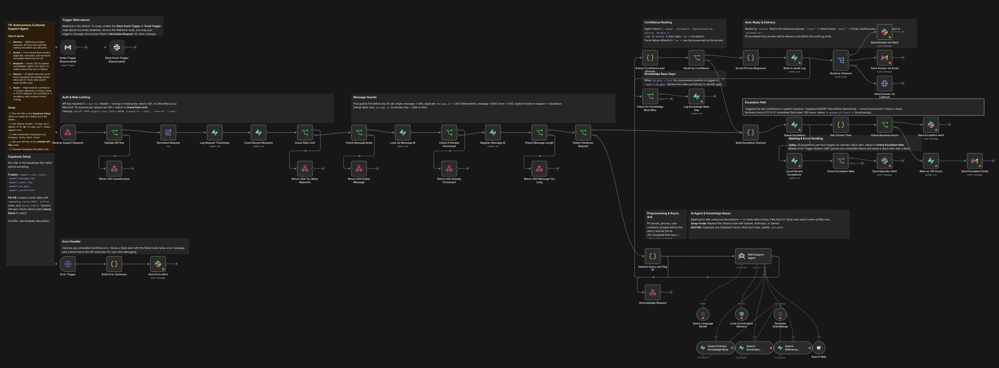

# Autonomous Customer Support Agent with Multi-KB RAG, Web Search Fallback and Human Escalation



A 50-node production-grade customer support agent that handles inbound support requests end-to-end. It validates and sanitises incoming requests, queries multiple knowledge bases, falls back to web search when the KB returns no result, routes answers by confidence score, and escalates to a human agent when needed — all asynchronously.

## Who it's for

**Advanced** — Engineering teams building production customer support automation that needs security guardrails, audit trails, multi-channel delivery, and human-in-the-loop escalation.

## Architecture overview

```
Webhook → Auth Guard → Rate Limiter → Message Guards → Async Ack (202)
         ↓
    RAG Support Agent (multi-KB + web search fallback)
         ↓
    Confidence Routing
    ├── High/Medium → Auto-reply (Slack / Email / Webhook callback)
    └── Low → Escalation queue → Slack alert or off-hours hold
```

## Nodes used

- **Webhook Trigger** — receives inbound support requests via POST
- **IF nodes** (×5) — API key validation, rate limiting, dedup, message guards, confidence routing
- **Supabase** (×7) — rate limit table, dedup ledger, audit log, KB gaps, escalation queue
- **AI Agent** — orchestrates multi-KB search and web fallback
- **Ollama Chat Model** — local LLM (swap for OpenAI/Anthropic/Gemini with one node change)
- **Ollama Embeddings** — local vector embeddings
- **Supabase Vector Store** (×3) — Primary, Secondary, and Reference knowledge bases
- **Wikipedia Tool** — web fallback when KB returns no result
- **Postgres Chat Memory** — persists conversation history
- **Slack** (×4) — answer delivery, escalation alerts, operator alerts, error alerts
- **Gmail** (×2) — answer delivery, escalation email
- **HTTP Request** — webhook callback delivery
- **Code nodes** (×3) — PII scrubbing, agent output parsing, error summary
- **Error Trigger** — catches execution failures and sends Slack alert with execution link

## Requirements

| Service | Credential | Notes |
|---------|-----------|-------|
| Supabase | Supabase API key | 5 tables required (SQL in canvas sticky) |
| Postgres | Postgres connection | For chat memory |
| Ollama | None | Running locally; models: `qwen2.5:7b` + `nomic-embed-text` |
| Slack | Slack Bot token | For answer delivery and alerts |
| Gmail | Gmail OAuth2 | For email delivery and escalation |

**API key guard:** Set your API key in the `Validate API Key` node. Callers must pass it as `x-api-key` in the request header.

## How to import

1. Download `workflow.json`
2. In n8n, go to **Workflows → Add workflow → Import from file**
3. Run the Supabase table SQL (found in the canvas sticky notes)
4. Connect all credentials in the n8n UI
5. Set real Slack channel IDs in the Slack nodes
6. Activate the workflow — the webhook URL is shown in the Webhook Trigger node

## Customization

- **Swap the LLM:** Replace the Ollama Chat Model node with OpenAI, Anthropic, or Gemini — no other changes needed
- **Change the trigger:** Swap the Webhook for a Slack Event Trigger or Gmail Trigger (disabled alternates are included on the canvas)
- **Adjust rate limiting:** Change the threshold in the `Count Recent Requests` IF node (default: 10 requests/60 seconds)
- **Adjust escalation threshold:** Change the business hours window in the `Check Business Hours` IF node (default: 9–17 UTC)
- **Add knowledge bases:** Duplicate any Supabase Vector Store tool node and connect to the agent

---

Built by [Neville Ko](https://www.linkedin.com/in/nevilleko/) · [fromus.ca/ai-builds](https://www.fromus.ca/ai-builds)
