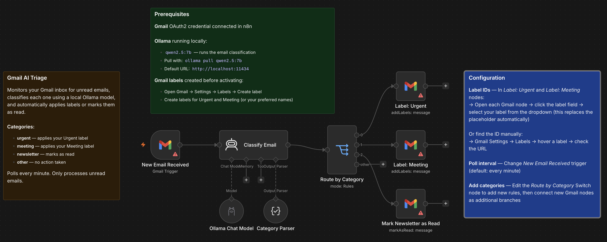

# Gmail AI Triage

An AI agent that monitors your Gmail inbox for unread emails, classifies each one using a local Ollama model, and automatically applies labels or marks emails as read based on category — without touching a cloud API.

## Who it's for

**Intermediate** — Anyone who wants to automatically sort a busy inbox by urgency and type, using a local model that keeps email content on-device.

## Nodes used

- **Gmail Trigger** — polls for unread emails every minute
- **AI Agent** — reads sender, subject, and preview; classifies into one of four categories
- **Ollama Chat Model** — local LLM inference (`qwen2.5:7b`, no cloud API required)
- **Structured Output Parser** — enforces `{"category": "..."}` JSON output from the agent
- **Switch** — routes by category to the correct action branch
- **Gmail** (×3) — applies Urgent label, applies Meeting label, or marks as read

## Requirements

| Service | Credential | Notes |
|---------|-----------|-------|
| Gmail | Gmail OAuth2 | Connect in the Gmail Trigger and all three Gmail action nodes |
| Ollama | None | Must be running locally; pull `qwen2.5:7b` with `ollama pull qwen2.5:7b` |

**Gmail labels required:** Create two labels in Gmail before activating — one for Urgent, one for Meeting. Go to **Gmail → Settings → Labels → Create new label**.

## How to import

1. Download `workflow.json`
2. In n8n, go to **Workflows → Add workflow → Import from file**
3. Connect your Gmail OAuth2 credential in the `New Email Received` trigger and all three Gmail action nodes
4. In `Label: Urgent` and `Label: Meeting` nodes, open the label field and select your labels from the dropdown — this replaces the placeholder automatically
5. Confirm Ollama is running at `http://localhost:11434` with `qwen2.5:7b` pulled
6. Activate the workflow — it will begin polling your inbox every minute

## Customization

- **Add categories:** Edit the `Route by Category` Switch node to add new rules, then connect additional Gmail nodes as branches (e.g. apply a "receipts" label, forward to another address)
- **Change poll interval:** Adjust the `New Email Received` trigger (default: every minute)
- **Swap the LLM:** Replace the Ollama Chat Model node with an OpenAI, Anthropic, or Gemini node — no other changes needed
- **Adjust classification:** Edit the system message in the `Classify Email` node to tune category definitions or add new categories

---

Built by [Neville Ko](https://www.linkedin.com/in/nevilleko/) · [fromus.ca/ai-builds](https://www.fromus.ca/ai-builds)
