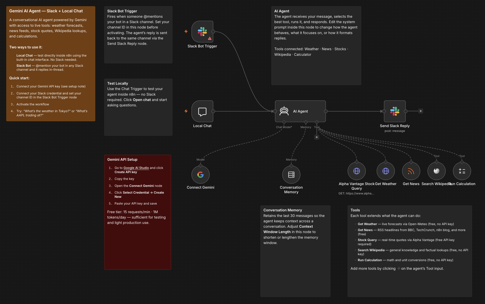

# Slack Gemini Agent

A conversational AI agent powered by Google Gemini that lives in your Slack workspace. @mention it in any channel and it responds in-thread using live tools: weather forecasts, news feeds, stock quotes, Wikipedia lookups, and calculations. Also includes a built-in n8n chat interface for local testing without Slack.

## Who it's for

**Intermediate** — Teams who want an AI assistant in Slack that can fetch live information and answer questions, without managing a separate bot infrastructure.

## Nodes used

- **Chat Trigger** — built-in n8n chat for local testing (no Slack required)
- **Slack Bot Trigger** — fires on @mentions in a Slack channel
- **AI Agent** — selects and runs the right tool based on the message
- **Gemini Chat Model** — Google Gemini as the LLM (free API tier available)
- **Window Buffer Memory** — retains last 30 messages for conversational context
- **Get Weather** (HTTP Request Tool) — live forecasts via Open-Meteo API (free, no key)
- **Get News** (RSS Feed Tool) — headlines from BBC, TechCrunch, n8n blog, and more (free)
- **Alpha Vantage Stock Query** (HTTP Request Tool) — real-time stock quotes (free API key)
- **Search Wikipedia** — factual lookups and general knowledge (free, no key)
- **Run Calculation** — math and unit conversions (free, no key)
- **Send Slack Reply** — posts the agent's response back to the Slack channel in-thread

## Requirements

| Service | Credential | Notes |
|---------|-----------|-------|
| Google Gemini | Gemini API key | Free at aistudio.google.com/app/apikey |
| Slack | Slack Bot token | Required for the Slack Bot Trigger and Send Slack Reply nodes |
| Alpha Vantage | API key | Free at alphavantage.co — replace `YOUR_ALPHAVANTAGE_API_KEY` in the Stock Query node |

## How to import

1. Download `workflow.json`
2. In n8n, go to **Workflows → Add workflow → Import from file**
3. Connect your Gemini API key in the `Connect Gemini` node
4. Connect your Slack credential in the `Slack Bot Trigger` and `Send Slack Reply` nodes
5. Set your Slack channel ID in the `Slack Bot Trigger` node
6. Replace `YOUR_ALPHAVANTAGE_API_KEY` in the `Alpha Vantage Stock Query` node
7. Activate the workflow

## Customization

- **Swap the LLM:** Replace the Gemini node with Ollama, OpenAI, or Anthropic — no other changes needed
- **Add tools:** Click ➕ on the agent's Tool input to connect Google Calendar, Gmail, or any HTTP Request tool
- **Adjust memory:** Change `Context Window Length` in the `Conversation Memory` node (default: 30 messages)
- **Test without Slack:** Use the Chat Trigger — the built-in chat works independently of the Slack path

---

Built by [Neville Ko](https://www.linkedin.com/in/nevilleko/) · [fromus.ca/ai-builds](https://www.fromus.ca/ai-builds)

*Based on [n8n template #6270](https://n8n.io/workflows/6270/) by Lucas Peyrin, extended with Slack reply routing, Wikipedia, and Calculator tools.*
