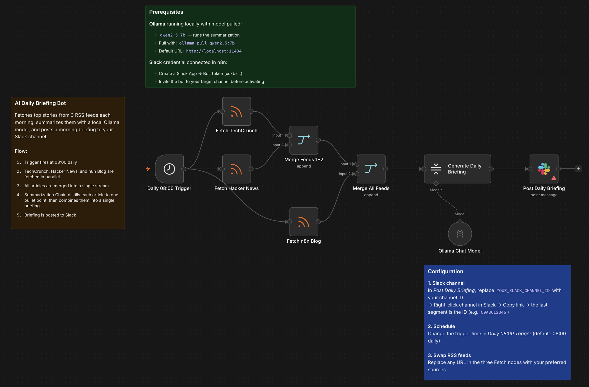

# AI Daily Briefing Bot

A scheduled workflow that fetches top stories from 3 RSS feeds each morning, summarizes them into a single briefing using a local Ollama model, and posts the result to Slack. No cloud API required — runs entirely on local inference.

## Who it's for

**Beginner / Intermediate** — Teams or individuals who want a daily digest of tech news delivered to Slack without building a custom RSS reader or paying for a hosted summarization service.

## Nodes used

- **Schedule Trigger** — fires daily at 08:00
- **RSS Feed Read** (×3) — fetches TechCrunch, Hacker News, and the n8n Blog
- **Merge** (×2) — combines all three feeds into a single stream
- **Summarization Chain** — `map_reduce` method: condenses each article to one bullet, then combines into a morning briefing
- **Ollama Chat Model** — local LLM inference (`qwen2.5:7b`, no cloud API required)
- **Slack** — posts the finished briefing to a channel

## Requirements

| Service | Credential | Notes |
|---------|-----------|-------|
| Ollama | None | Must be running locally; pull `qwen2.5:7b` with `ollama pull qwen2.5:7b` |
| Slack | Slack Bot token | Bot must be invited to your target channel |

## How to import

1. Download `workflow.json`
2. In n8n, go to **Workflows → Add workflow → Import from file**
3. Connect your Slack credential in the `Post Daily Briefing` node
4. Set your channel ID in the `Post Daily Briefing` node: replace `YOUR_SLACK_CHANNEL_ID` with the ID of your channel (right-click a channel in Slack → **Copy link** → the ID is the last segment)
5. Confirm Ollama is running at `http://localhost:11434` with `qwen2.5:7b` pulled
6. Click **Test workflow** to run it manually, or activate the workflow to run daily at 08:00

## Customization

- **Change the schedule:** Edit the trigger time in `Daily 08:00 Trigger` to any hour or day pattern
- **Swap RSS sources:** Replace any URL in the three Fetch nodes with your preferred feeds (Reuters, Wired, GitHub blog, etc.)
- **Swap the LLM:** Replace the Ollama Chat Model node with an OpenAI, Anthropic, or Gemini node — no other changes needed
- **Add more feeds:** Duplicate a Fetch node and connect it through an additional Merge node

---

Built by [Neville Ko](https://www.linkedin.com/in/nevilleko/) · [fromus.ca/ai-builds](https://www.fromus.ca/ai-builds)
