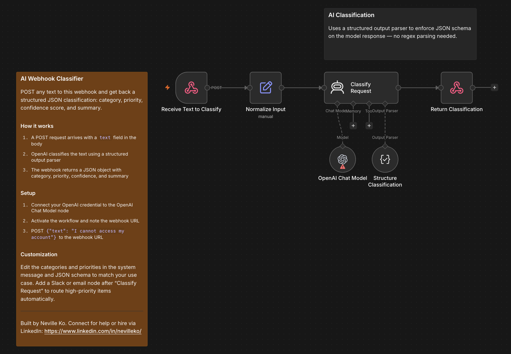

# AI Webhook Classifier

POST any text to this webhook and get back a structured JSON classification: category, priority, confidence score, and a one-sentence summary. Schema enforcement means valid JSON every time — no regex or post-processing needed.

## Who it's for

**Intermediate** — Developers building support triage systems, content routers, or any pipeline that needs AI-powered categorization at the API boundary.

## Nodes used

- **Webhook** — receives the POST request with the text to classify
- **Edit Fields** — normalizes the `text` field from the request body
- **AI Agent** — runs the classification prompt with a structured output parser attached
- **OpenAI Chat Model** — LLM powering the classification agent
- **Structured Output Parser** — enforces a JSON schema on the model response
- **Respond to Webhook** — returns `{ success, text, classification }` as JSON

## Requirements

| Service | Credential | Notes |
|---------|-----------|-------|
| OpenAI | OpenAI API key | Any GPT model works |

## How to import

1. Download `workflow.json`
2. In n8n, go to **Workflows → Add workflow → Import from file**
3. Connect your OpenAI credential to the OpenAI Chat Model node
4. Activate the workflow and note the webhook URL
5. POST `{"text": "I cannot log in after resetting my password"}` to test — you'll get back a JSON object with `category`, `priority`, `confidence`, and `summary`

## Customization

- **Change the categories:** Edit the category list in the system message and update the JSON schema in the Structured Output Parser to match
- **Route high-priority items:** Add a Slack or email node after `Classify Request` triggered by an IF node checking `classification.priority === "high"`
- **Swap the LLM:** Replace the OpenAI Chat Model node with an Anthropic or Gemini node — no other changes needed

---

Built by Neville Ko. Connect for help or hire via LinkedIn: https://www.linkedin.com/in/nevilleko/
