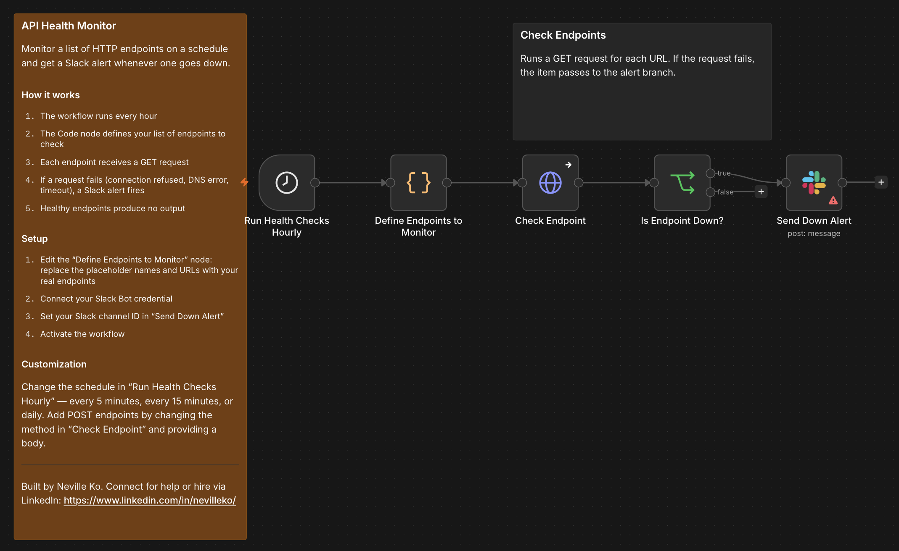

# API Health Monitor

Monitor a list of HTTP endpoints on a schedule and get a Slack alert whenever one goes down. Healthy endpoints produce no output — you only hear from this workflow when something breaks.

## Who it's for

**Beginner** — Developers and ops teams who need simple uptime monitoring without running a dedicated monitoring service.

## Nodes used

- **Schedule Trigger** — fires every hour to kick off the check cycle
- **Code** — defines the list of endpoints to monitor (name + URL pairs)
- **HTTP Request** — pings each endpoint with a GET request
- **If** — routes failed requests (errors, timeouts) to the alert branch
- **Slack** — posts a down alert with the service name, URL, and error message

## Requirements

| Service | Credential | Notes |
|---------|-----------|-------|
| Slack | Slack Bot token | Bot must be invited to the alert channel |

## How to import

1. Download `workflow.json`
2. In n8n, go to **Workflows → Add workflow → Import from file**
3. Open the `Define Endpoints to Monitor` node and replace the placeholder names and URLs with your real endpoints
4. Connect your Slack Bot credential to the `Send Down Alert` node
5. Set your channel ID in `Send Down Alert`: replace `YOUR_SLACK_CHANNEL_ID` with the ID of your channel (right-click a channel in Slack → **Copy link** → the ID is the last segment)
6. Activate the workflow

## Customization

- **Change the check interval:** Edit the trigger in `Run Health Checks Hourly` — every 5 minutes, every 15 minutes, or daily
- **Add more endpoints:** Append additional `{ name, url }` objects to the array in the Code node
- **Test POST endpoints:** Change the method in `Check Endpoint` from GET to POST and add a request body

---

Built by Neville Ko. Connect for help or hire via LinkedIn: https://www.linkedin.com/in/nevilleko/
