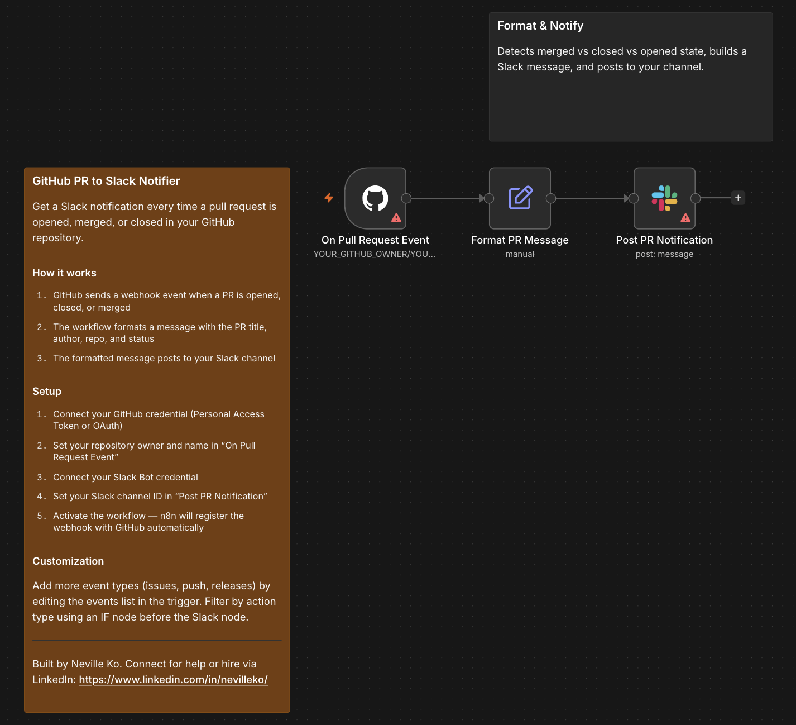

# GitHub PR to Slack Notifier

Get a Slack notification every time a pull request is opened, merged, or closed in your GitHub repository. The message includes the PR title, author, repo name, and a direct link — with automatic distinction between merged and closed-without-merging.

## Who it's for

**Beginner** — Engineering teams who want PR activity surfaced in Slack without constantly switching to GitHub.

## Nodes used

- **GitHub Trigger** — listens for pull request events via a GitHub webhook
- **Edit Fields** — formats the PR status, emoji, and Slack message text
- **Slack** — posts the formatted notification to your channel

## Requirements

| Service | Credential | Notes |
|---------|-----------|-------|
| GitHub | Personal Access Token or OAuth | Needs `repo` scope to register webhooks |
| Slack | Slack Bot token | Bot must be invited to the target channel |

Your n8n instance needs a public URL for GitHub to deliver webhook events. Works with n8n Cloud out of the box; self-hosted requires a public domain or tunnel (e.g. ngrok).

## How to import

1. Download `workflow.json`
2. In n8n, go to **Workflows → Add workflow → Import from file**
3. Connect your GitHub credential to the `On Pull Request Event` node
4. Set your repository owner and name in `On Pull Request Event`
5. Connect your Slack Bot credential to the `Post PR Notification` node
6. Set your channel ID in `Post PR Notification`: replace `YOUR_SLACK_CHANNEL_ID` with the ID of your channel (right-click a channel in Slack → **Copy link** → the ID is the last segment)
7. Activate the workflow — n8n registers the webhook with GitHub automatically

## Customization

- **Add more event types:** Edit the events list in the trigger to include issues, pushes, or releases
- **Filter by action:** Add an IF node before the Slack node to notify only on merged PRs, for example
- **Route by repository:** Use a Switch node to post to different Slack channels based on `$json.repository.full_name`

---

Built by Neville Ko. Connect for help or hire via LinkedIn: https://www.linkedin.com/in/nevilleko/
