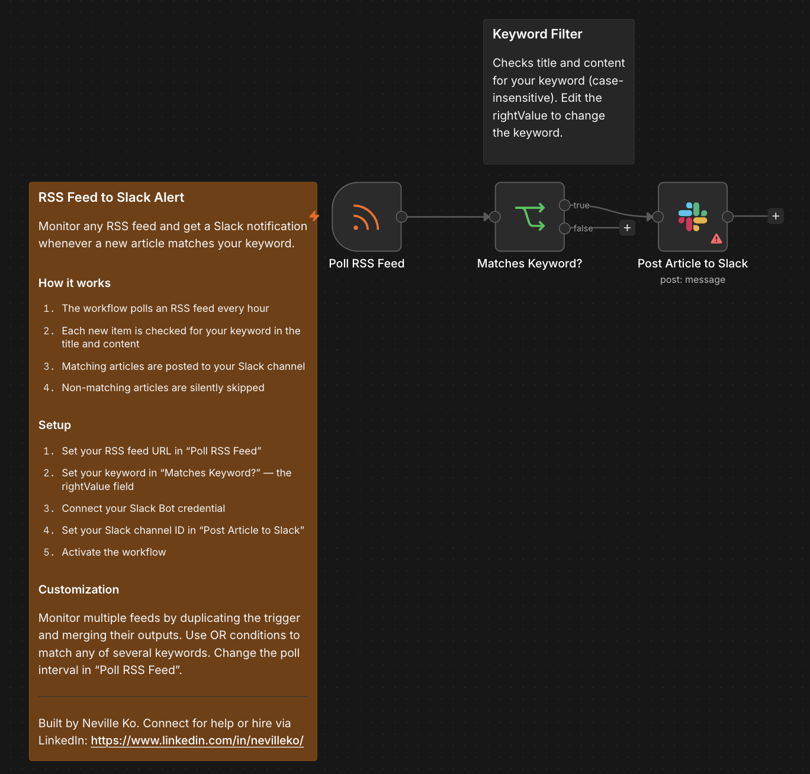

# RSS Feed to Slack Alert

Monitor any RSS feed and get a Slack notification whenever a new article matches your keyword. Non-matching articles are silently skipped — you only get notified when something relevant appears.

## Who it's for

**Beginner** — Marketers, researchers, and developers who want to track topics across news feeds, blogs, or podcasts without manually checking them.

## Nodes used

- **RSS Feed Read Trigger** — polls an RSS feed URL on a schedule
- **If** — checks whether the article title or content contains your keyword (case-insensitive)
- **Slack** — posts the matching article title and link to your channel

## Requirements

| Service | Credential | Notes |
|---------|-----------|-------|
| Slack | Slack Bot token | Bot must be invited to the target channel |

Set your RSS feed URL in `Poll RSS Feed` — any publicly accessible feed works, no credential required.

## How to import

1. Download `workflow.json`
2. In n8n, go to **Workflows → Add workflow → Import from file**
3. Open `Poll RSS Feed` and replace `YOUR_RSS_FEED_URL` with your feed URL
4. Open `Matches Keyword?` and replace `YOUR_KEYWORD` in the rightValue field with your keyword
5. Connect your Slack Bot credential to the `Post Article to Slack` node
6. Set your channel ID in `Post Article to Slack`: replace `YOUR_SLACK_CHANNEL_ID` with the ID of your channel (right-click a channel in Slack → **Copy link** → the ID is the last segment)
7. Activate the workflow

## Customization

- **Monitor multiple feeds:** Duplicate the trigger node and connect both outputs to a Merge node before the IF node
- **Match any of several keywords:** Switch the IF node from AND to OR and add additional keyword conditions
- **Change the poll frequency:** Edit the interval in `Poll RSS Feed` — hourly, daily, or every N minutes

---

Built by Neville Ko. Connect for help or hire via LinkedIn: https://www.linkedin.com/in/nevilleko/
