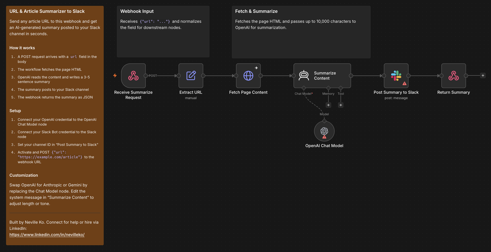

# URL & Article Summarizer to Slack

POST any article URL to this webhook and get an AI-generated summary posted to your Slack channel in seconds. The webhook also returns the summary as JSON so you can use it programmatically.

## Who it's for

**Beginner–Intermediate** — Researchers, content teams, and developers who want to digest articles quickly without reading them in full.

## Nodes used

- **Webhook** — receives the POST request with the article URL
- **Edit Fields** — normalizes the `url` field from the request body
- **HTTP Request** — fetches the raw HTML of the target page
- **AI Agent** — summarizes the page content using OpenAI
- **OpenAI Chat Model** — LLM powering the summarization agent
- **Slack** — posts the summary to your channel
- **Respond to Webhook** — returns `{ success, url, summary }` as JSON

## Requirements

| Service | Credential | Notes |
|---------|-----------|-------|
| OpenAI | OpenAI API key | Any GPT model works |
| Slack | Slack Bot token | Bot must be invited to the target channel |

## How to import

1. Download `workflow.json`
2. In n8n, go to **Workflows → Add workflow → Import from file**
3. Connect your OpenAI credential to the OpenAI Chat Model node
4. Connect your Slack Bot credential to the Slack node
5. Set your channel ID in `Post Summary to Slack`: replace `YOUR_SLACK_CHANNEL_ID` with the ID of your channel (right-click a channel in Slack → **Copy link** → the ID is the last segment)
6. Activate the workflow and POST `{"url": "https://example.com/article"}` to the webhook URL

## Customization

- **Swap the LLM:** Replace the OpenAI Chat Model node with an Anthropic or Gemini node — no other changes needed
- **Adjust the summary style:** Edit the prompt in the `Summarize Content` agent node to change length, tone, or format
- **Route by domain:** Add a Switch node after the agent to post to different Slack channels based on the article's source

---

Built by Neville Ko. Connect for help or hire via LinkedIn: https://www.linkedin.com/in/nevilleko/
